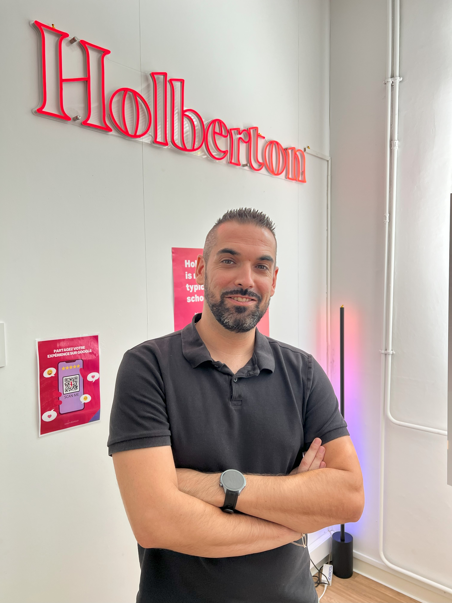

# Hi, I'm Mickael!

---

## About Me

- Student at **Holberton School**
- Passionate about web development and modern technologies
- Constantly learning: **Python, JavaScript, ES6, NoSQL**
- Goal: Become an accomplished full-stack developer
- How to reach me: [GitHub](https://github.com/mickael-mur)

---

## Technologies & Tools

### Languages

### Frameworks & Libraries

### Databases

### Tools

---

## GitHub Statistics

---

## GitHub Trophies

---

## Contribution Activity

---

## Featured Projects

### Portfolio Website

Personal portfolio website showcasing my projects and skills

---

### Mnesya

Memory-based application project

---

### Holberton School Projects

Collection of backend development projects covering Python, JavaScript, ES6, NoSQL, and more

---

## Contact Me

---

### Quote of the Day

### Visitor Counter

---

**Feel free to browse my repositories and give them a star if you find something interesting!**

